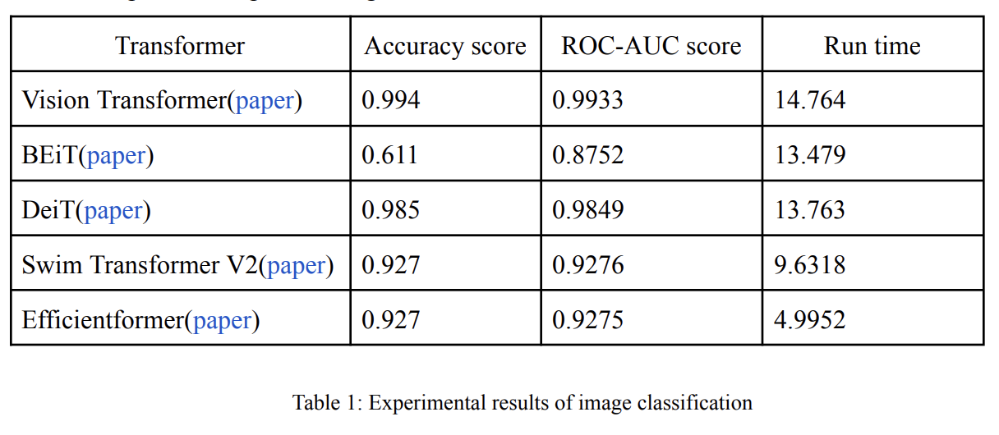

# Image-Classification-using-Transformer

I utilized ViT, BEiT, DeiT, Swin Transformer V2, and Efficientformer, employing the Hugging Face library. Before the classification phase, preprocessing of the images was also performed. Based on empirical analysis, it was determined that the vision transformer exhibited superior performance in terms of accuracy and ROC-AUC score when compared to other transformer models. Notably, Efficientformer demonstrated the fastest computational speed among the evaluated models.

